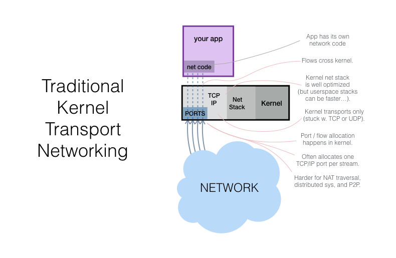
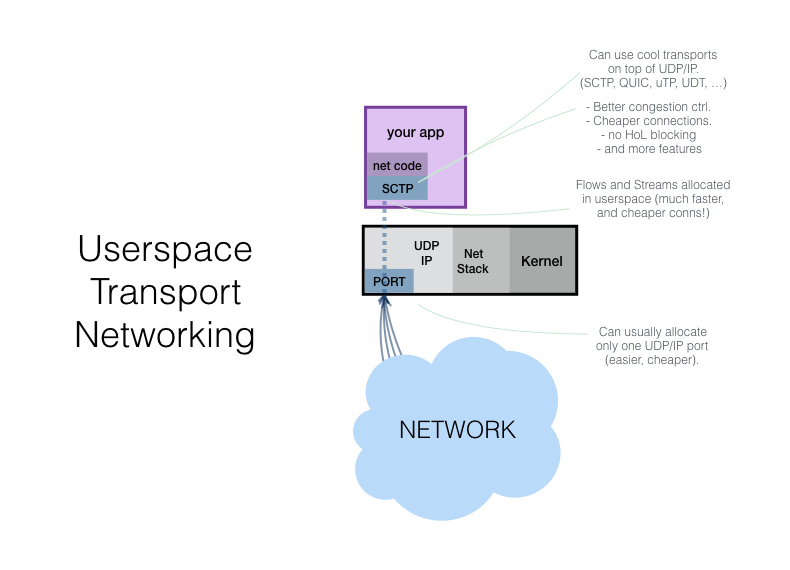
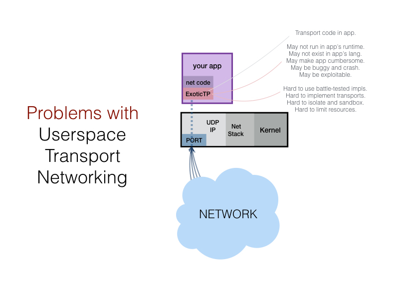
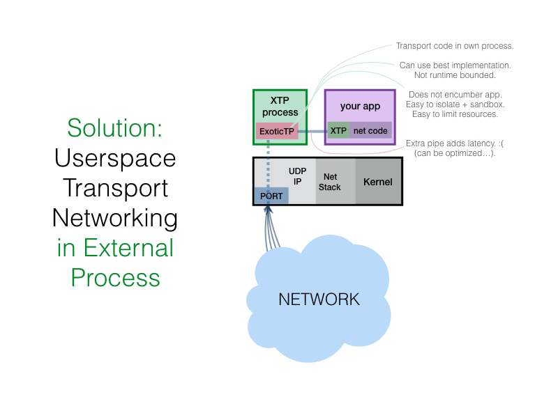
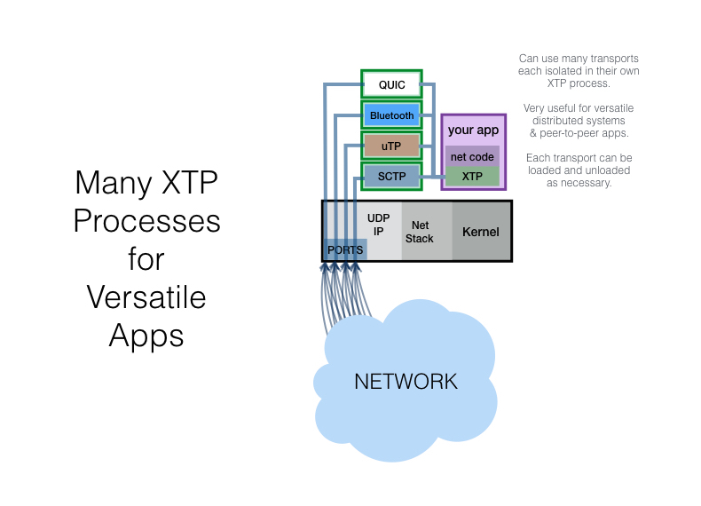
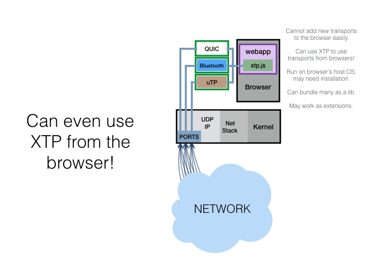

# XTP - eXternal Transports Protocol

> Let's put exotic network transports outside the main process.
> That way we can use implementations in other languages easily.
> And isolate, sandbox, and resource constrain unproven implementations.

## Motivation

External Transports are [libp2p network Transport](https://libp2p.io/transports) implementations provided as separate processes. This makes sense because:

- Solid implementations for most transport protocol are scarce, should be able to use the best.
- The 1 or 2 battle-tested implementations are written in a language different than your client app.
  - Thus trickier to use in the same process (even C is annoying in Go).
- You are [writing a network stack in many languages](https://libp2p.io)
  - Want to offer a good implementation of the transport as a baseline to all languages (eg. use libquic from Go until go-quic is made...)
- The transport must run differently:
  - The app runtime cannot run the language (eg javascript in a browser).
  - The app is in a different machine than the transport network interface.
- May want to isolate the transport implementation because:
  - Want to constrain its resources, separately from the main process. Can jail/containerize it.
  - Maybe it is buggy or "not so trusted".
    - Should be able to crash and restart without crashing your main process.
    - Can sandbox it to avoid exploits.

XTP is a protocol and tool suite for working with External Transports.

## Illustrations

---

---

---

---

---

## How is it built?

#### The XTP project combines:

- an RPC and [multiformats](https://github.com/multiformats) duplex stream protocol, called [xtp-ctl](./xtp-ctl.md). xtp-ctl is used to "control" the external transport implementation.
- xtp-lib is a library of components, iplemented in various languages, including:
	- XTP Service - external transport wrapper
	- XTP Client - XTP Service bindings

#### Component Diagram

#### XTP is built with:

- [multiformats](https://github.com/multiformats) for self-describing protocols
  - [multistream](https://github.com/multiformats/multistream) for connection negotiation
  - [multiaddr](https://github.com/multiformats/multiaddr) for endpoint addressing
- the [libp2p](https://github.com/libp2p) [transport interface and modules](https://libp2p.io/transports)

## Project

### About

XTP spun out of the [IPFS Project](https://github.com/ipfs/ipfs).

## Roadmap

Implementation Roadmap:

- [x] Define Use Cases and Constraints
- [x] Define Architecture
	- [x] Chart out components
	- [x] Write readme explaining design
- [ ] Write Specs
	- [ ] Write xtp-ctl spec (pipe + protocol)
	- [ ] Write XTP Service spec
	- [ ] Write XTP Client spec
- [ ] Implement XTP in common languages
	- [ ] Implement go-xtp
		- [ ] Implement xtl-ctl in Go
		- [ ] Implement XTP Service in Go
		- [ ] Implement XTP Client bindings in Go
	- [ ] Implement js-xtp
		- [ ] Implement xtl-ctl in JS
		- [ ] Implement XTP Service bindings in JS
		- [ ] Implement XTP Client bindings in JS
	- [ ] Implement rust-xtp
		- [ ] Implement xtl-ctl in Rust
		- [ ] Implement XTP Service bindings in Rust
		- [ ] Implement XTP Client bindings in Rust
- [ ] XTPify some transports
	- [ ] xtp-utp, using C++ libutp
	- [ ] xtp-quic, using C++ libquic
	- [ ] xtp-udt, using C++ libudt
	- [ ] xtp-webrtc, using node-webrtc? 
	- [ ] xtp-ble 

## Contribute

Please contribute! Pull requests very much accepted.

Please read, and abide by: 
- The [IPFS Project Contribution Guidelines](https://github.com/ipfs/community/blob/master/contribution-guidelines.md)
- The [IPFS Project Code of Conduct](https://github.com/ipfs/community/blob/master/code-of-conduct.md) 

## FAQ

#### Isn't this much slower than in the same process?

The data may cross the kernel again to move from the External Transport to the main process and vice versa. This additional kernel boundary passes will slow down the transport, adding syscall latencies.

For extremely low latency applications this will be unacceptable. But in practice, most applications will not suffer much because:

- External transports enable us to get implementations working right away. This can be huge in terms of development and deployment, shaving weeks off development, or enabling a transport that wouldn't otherwise be available at all.
- Can optimize by creating a language-specific implementation of the transport later, once you prove the external process is the bottleneck, and you're sure the implementation is sound.
- For most simple apps, the bottlenecks are not in crossing kernel boundaries, they are in the network latencies, storage media I/O, or data processing.
- Good memory sharing or IPC implementations can be leveraged to improve or completely solve this slow down.

So, don't worry about this until you PROVE it's a problem. Then, go ahead, write an implementation of the transport in your preferred language.

#### Why the name XTP? can we change it?

Sure, find something better. Maybe

- Exo-Transports
- XTransport
- External Transports
- (ETP) External Transport Protocol
